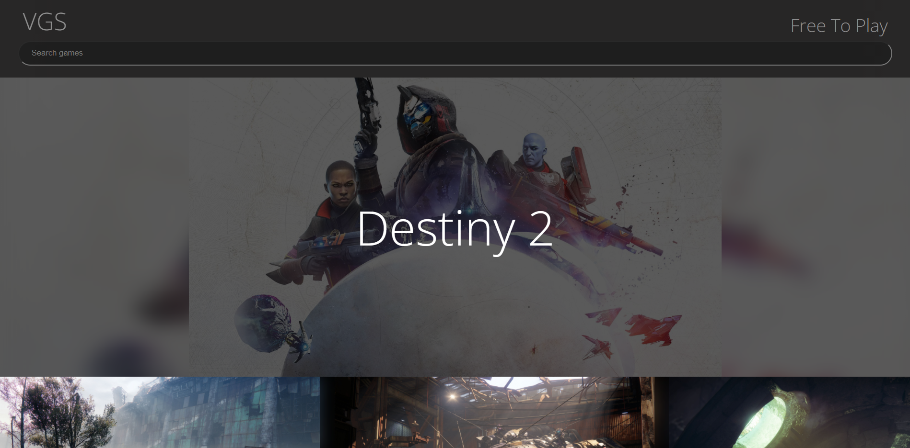
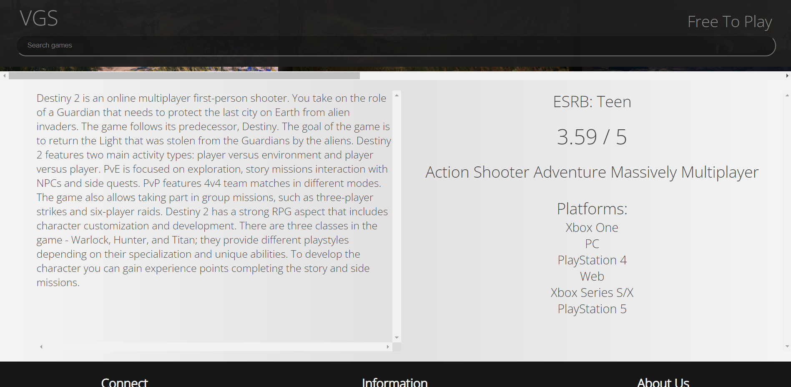
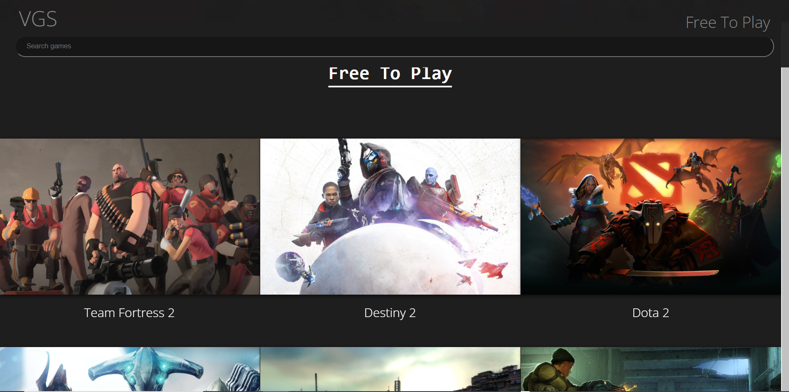

# VideoGameSearch
## Any Game, Any Time.

  

## Overview
Video Gaming Search is an application that allows users to search for nearly any video game of their choice. Searches return screenshots, a description of the game, the ESRB rating, a list of avalible platforms and reviewer score.

Give it a try: https://videogamesearch.netlify.app/

## Work Summary.
VGS is a group project where we created a search based web application using an API. The API gives us data that we display for the user. 

API: RAWG: https://rawg.io/apidocs

# Have A Look:
 ## The Home Page
 Search for any game or view catagories.
  
 
 

## Viewing Information
Searches return screenshots, a description of the game, the ESRB rating, a list of avalible platforms and reviewer score.
 

 

## Browsing
Users can scroll through a list of games.
 

 

# The Team:
 

Stephen Doty

- Primary team Role: Javascript, API calls, and assisted with CSS animations. 

Devin Brock

- Primary team Role: HTML CSS styling and README.

James Ivy

- Primary team Role: HTML, and CSS styling. 

# Tools used for this project:

- HTML
- CSS
- JavaScipt

Other:
- JSON

 

Give it a try: https://videogamesearch.netlify.app/
